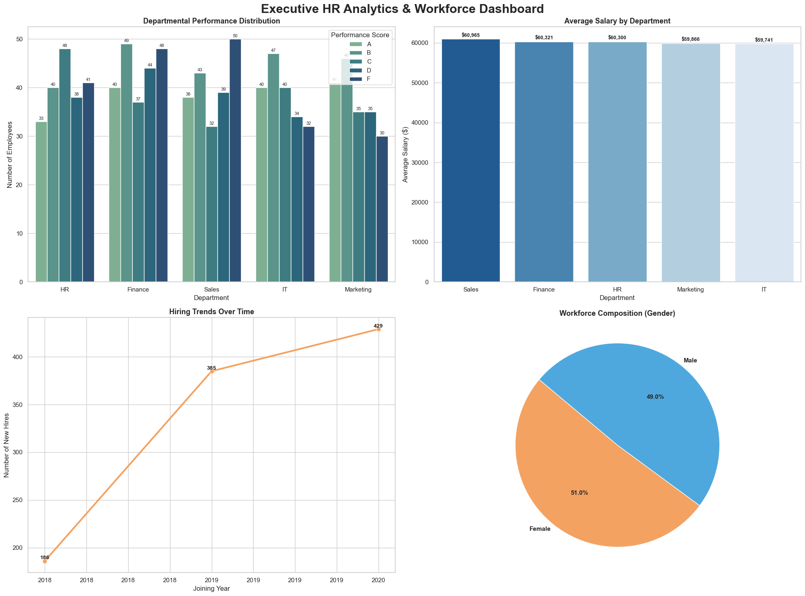

# HR-Workforce-Analysis 📊

An executive HR Analytics & Workforce Dashboard designed to provide deep insights into employee performance, salary distribution, hiring trends, and gender diversity.

## 🚀 Key Visualizations
* **Departmental Performance Distribution:** Analyzes employee scores across different sectors.
* **Average Salary by Department:** Highlights compensation structures.
* **Hiring Trends Over Time:** Tracks recruitment growth.
* **Workforce Composition:** Visualizes gender diversity ratios.

## 🛠️ Tech Stack
* Python
* Jupyter Notebook
* Matplotlib & Seaborn

## 📊 Dashboard Preview

